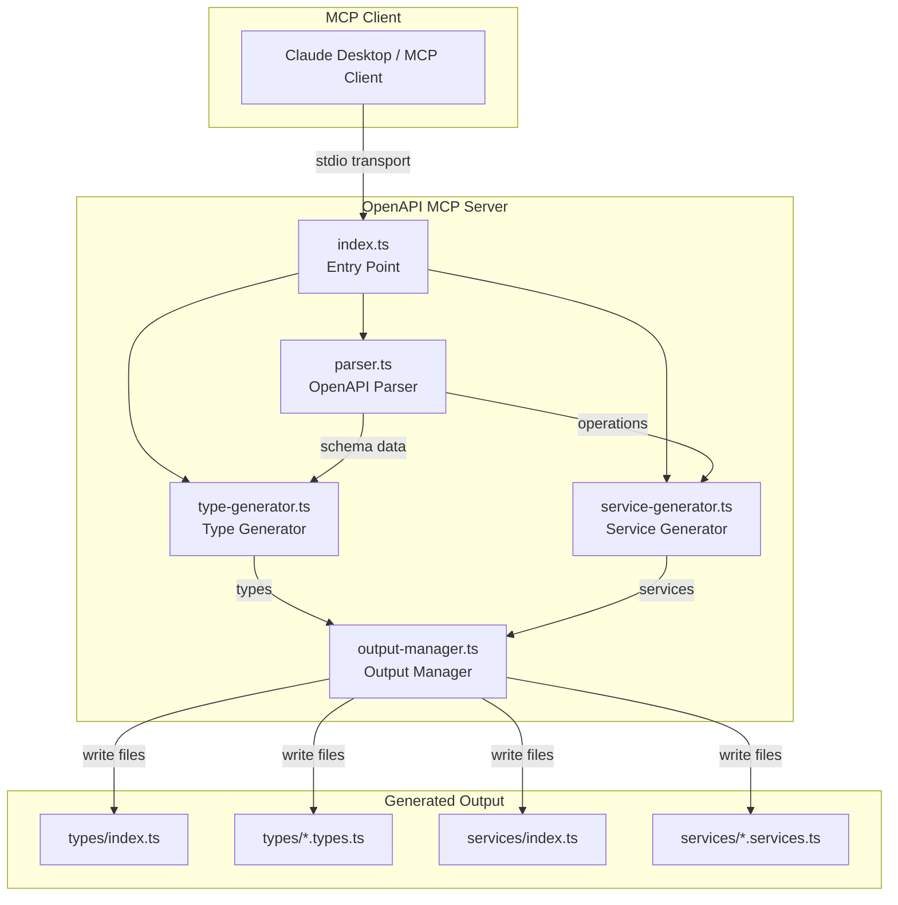
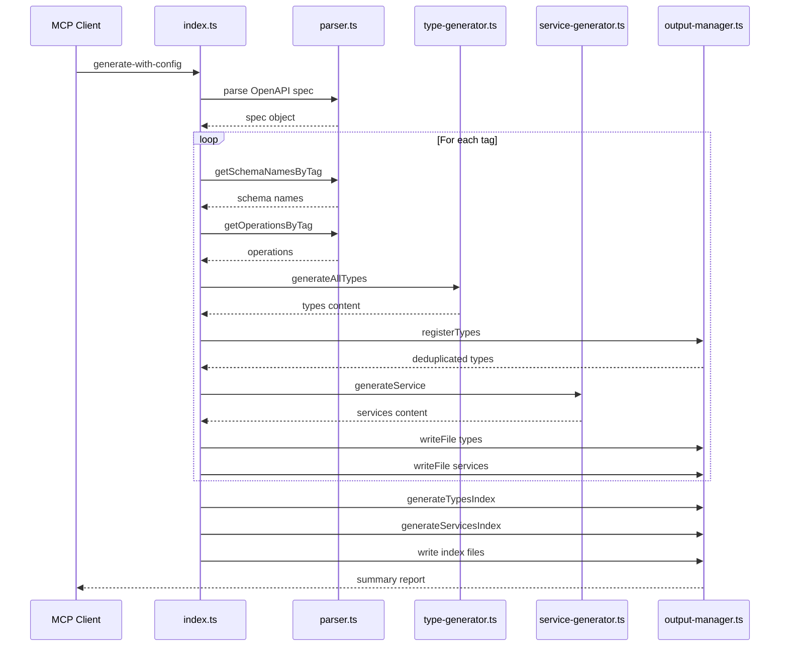
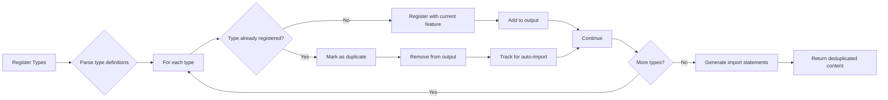
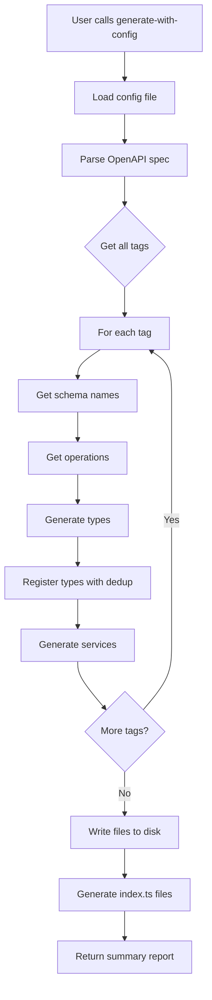
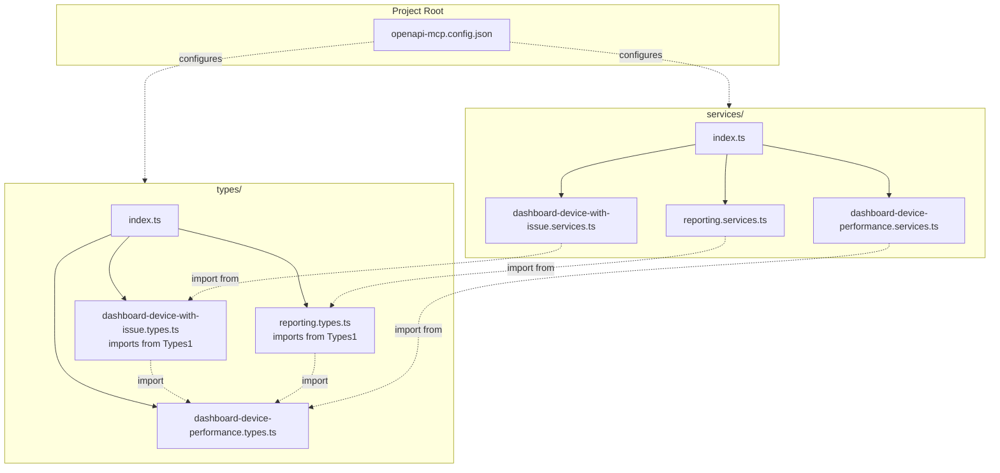
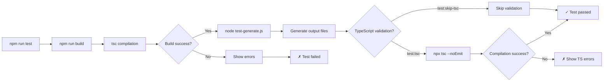

# OpenAPI MCP Server - Architecture Documentation

## Overview

OpenAPI MCP Server adalah Model Context Protocol (MCP) server yang menggenerate TypeScript code dari OpenAPI specifications. Server ini dirancang untuk menghasilkan type-safe API clients dengan fitur duplicate type handling, auto-imports, dan TypeScript validation.

## Tech Stack

- **Runtime**: Node.js >= 18
- **Language**: TypeScript 5.0+
- **Framework**: @modelcontextprotocol/sdk 1.27.1+
- **Module System**: ES Modules (ES2022)

## System Architecture



### Component Interaction



## Core Components

### 1. Entry Point (`src/index.ts`)

**Responsibility**: MCP server initialization, tool registration, and request routing.

**Key Functions**:
- Initializes MCP server with `@modelcontextprotocol/sdk`
- Registers 4 tools: `list-tags`, `find-tag-by-path`, `generate-typescript`, `generate-with-config`
- Routes tool calls to appropriate handlers
- Manages stdio transport for MCP communication

**Tools**:

| Tool | Description | Input | Output |
|------|-------------|-------|--------|
| `list-tags` | List all tags with endpoint counts | `specPath` | Tags array with counts |
| `find-tag-by-path` | Find tags by URL path pattern | `specPath`, `pathQuery` | Path matches |
| `generate-typescript` | Generate TS types & services (simple) | `specPath`, `tag`, `forceRequired` | File contents |
| `generate-with-config` ⭐ | Generate with config, dedup, auto-imports | `specPath`, `configPath`, `tag` | File system output |

### 2. OpenAPI Parser (`src/parser.ts`)

**Responsibility**: Parse and extract information from OpenAPI specification files.

**Key Methods**:

```typescript
class OpenAPIParser {
  constructor(specPath: string)
  
  // Tag operations
  getAllTags(): TagInfo[]
  findTagsByPath(pathQuery: string): PathMatch[]
  getOperationsByTag(tagName: string): Operation[]
  
  // Schema operations
  getAllSchemas(): Record<string, SchemaObject>
  getSchema(schemaName: string): SchemaObject | undefined
  resolveRef(ref: string): SchemaObject | undefined
  getSchemaNamesByTag(tagName: string): Set<string>
}
```

**Features**:
- Extracts unique tags with endpoint counts
- Path pattern matching for tag discovery
- Recursive schema dependency resolution
- `$ref` resolution for local references

### 3. TypeScript Type Generator (`src/type-generator.ts`)

**Responsibility**: Generate TypeScript type definitions from OpenAPI schemas.

**Key Methods**:

```typescript
class TypeScriptTypeGenerator {
  constructor(spec: OpenAPISpec, forceRequired: boolean = true)
  
  // Generate single type
  generateType(schemaName: string, schema: SchemaObject): string
  
  // Generate all types for a feature
  generateAllTypes(schemaNames: string[]): string
  
  // Generate operation-specific types
  generateOperationTypes(operationId: string, operation: OperationObject): {
    types: string
    requestTypeName?: string
    responseTypeName?: string
  }
  
  // Get operation type names
  getOperationTypeNames(operationId: string): { 
    requestType: string, 
    responseType: string 
  }
}
```

**Type Mapping**:

| OpenAPI Type | TypeScript Type |
|--------------|-----------------|
| `string` | `string` |
| `integer`, `number` | `number` |
| `boolean` | `boolean` |
| `array` | `T[]` |
| `object` | `Record<string, unknown>` or inline type |
| `enum` | Union type (`'a' \| 'b' \| 'c'`) |

**Features**:
- Topological sorting for dependency ordering
- `$ref` resolution to type names
- Force required properties (configurable)
- Operation-specific Request/Response types

### 4. Service Generator (`src/service-generator.ts`)

**Responsibility**: Generate service functions with Axios calls.

**Key Methods**:

```typescript
class ServiceGenerator {
  // Generate service object for a tag
  generateService(tagName: string, operations: Operation[]): string
  
  // Internal methods
  private tagToServiceObjectName(tagName: string): string
  private operationToFunctionName(operationId: string): string
  private generateMethod(path: string, method: string, operation: OperationObject): { code, imports }
  private generateJSDoc(operation, path, method, params, responseType): string
}
```

**Naming Conventions**:

| Input | Output |
|-------|--------|
| Tag: `reporting-controller` | Service: `Reporting` |
| Tag: `dashboard-device-performance-controller` | Service: `DashboardDevicePerformance` |
| OperationId: `modifySLaCustomers` | Function: `modifySLaCustomers` |

**Generated Service Pattern**:

```typescript
import { axiosInstance } from '@/lib/axios';
import type { ModifySLaCustomersRequest, ModifySLaCustomersResponse } from '../types';

export const Reporting = {
  /**
   * Modify SLa Customers
   * @param request - ModifySLaCustomersRequest
   * @returns Promise<ModifySLaCustomersResponse>
   * @method POST /v1/reporting/sla-customers
   */
  modifySLaCustomers: async (request: ModifySLaCustomersRequest): Promise<ModifySLaCustomersResponse> => {
    const { data } = await axiosInstance.post(`/v1/reporting/sla-customers`, request, undefined);
    return data;
  },
  // ... other methods
};
```

### 5. Output Manager (`src/output-manager.ts`)

**Responsibility**: Manage file output, handle duplicate types, and generate index files.

**Key Methods**:

```typescript
class OutputManager {
  constructor(configPath: string)
  
  // Configuration
  getConfig(): OpenApiMcpConfig | null
  getTypesOutputDir(): string
  getServicesOutputDir(): string
  
  // Type management
  registerTypes(featureName: string, typesContent: string): string
  addMissingImports(featureName: string, content: string): string
  
  // File operations
  writeFile(filePath: string, content: string): void
  generateTypesIndex(files: string[]): string
  generateServicesIndex(files: string[]): string
  
  // Reporting
  getDuplicatesReport(): string
}
```

**Duplicate Type Handling Algorithm**:



**Example Duplicate Resolution**:

```
Found 3 duplicate type(s):

  - ChartDataSet
    ✓ Kept in: dashboard-device-performance
    ✗ Removed from: dashboard-device-with-issue, reporting
    
  - ChartModel
    ✓ Kept in: dashboard-device-performance
    ✗ Removed from: dashboard-device-with-issue, reporting
```

**Auto-Generated Import**:

```typescript
// In dashboard-device-with-issue.types.ts
import type { ChartDataSet, ChartModel } from './dashboard-device-performance.types';

export type DashboardDeviceWithIssue = {
  chartData: ChartDataSet;
  chart: ChartModel;
  // ...
};
```

## Data Flow

### generate-with-config Flow



## Configuration

### Config File (`openapi-mcp.config.json`)

```json
{
  "typesOutputDir": "./src/types",
  "servicesOutputDir": "./src/services"
}
```

**Path Resolution**:
- Relative paths are resolved from config file directory
- Absolute paths are used as-is

**Default (no config)**:
- Types: `./types/`
- Services: `./services/`

## Generated Output Structure



### Index Files

**types/index.ts**:
```typescript
// Auto-generated types index
export * from './dashboard-device-performance.types';
export * from './dashboard-device-with-issue.types';
export * from './reporting.types';
```

**services/index.ts**:
```typescript
// Auto-generated services index
export * from './dashboard-device-performance.services';
export * from './dashboard-device-with-issue.services';
export * from './reporting.services';
```

## Class Diagram

```mermaid
classDiagram
    class OpenAPIParser {
        -spec: OpenAPISpec
        -baseUrl: string
        +getAllTags() TagInfo[]
        +findTagsByPath(pathQuery: string) PathMatch[]
        +getOperationsByTag(tagName: string) Operation[]
        +getSchemaNamesByTag(tagName: string) Set~string~
        +getSchema(schemaName: string) SchemaObject
        +resolveRef(ref: string) SchemaObject
    }

    class TypeScriptTypeGenerator {
        -spec: OpenAPISpec
        -forceRequired: boolean
        +generateType(schemaName: string, schema: SchemaObject) string
        +generateAllTypes(schemaNames: string[]) string
        +generateOperationTypes(operationId: string, operation: OperationObject) TypesResult
        +getOperationTypeNames(operationId: string) TypeNames
        -getTsType(schema: SchemaObject, context: string[]) string
        -topologicalSort(schemaNames: string[], schemas: Record) string[]
    }

    class ServiceGenerator {
        +generateService(tagName: string, operations: Operation[]) string
        -tagToServiceObjectName(tagName: string) string
        -operationToFunctionName(operationId: string) string
        -generateMethod(path: string, method: string, operation: OperationObject) MethodResult
        -generateJSDoc(operation, path, method, params, responseType) string
    }

    class OutputManager {
        -config: OpenApiMcpConfig
        -definedTypes: Map~string, string~
        -duplicates: DuplicateTypeInfo[]
        +registerTypes(featureName: string, typesContent: string) string
        +writeFile(filePath: string, content: string) void
        +generateTypesIndex(files: string[]) string
        +generateServicesIndex(files: string[]) string
        +getDuplicatesReport() string
        +addMissingImports(featureName: string, content: string) string
    }

    OpenAPIParser --> OpenAPISpec : parses
    TypeScriptTypeGenerator --> OpenAPISpec : uses
    ServiceGenerator --> Operation : uses
    OutputManager --> DuplicateTypeInfo : tracks
```



## Type System

### Schema Type Resolution

```typescript
// OpenAPI Schema
{
  "type": "object",
  "properties": {
    "id": { "type": "integer" },
    "name": { "type": "string" },
    "status": { "enum": ["active", "inactive"] },
    "items": { 
      "type": "array",
      "items": { "$ref": "#/components/schemas/Item" }
    }
  }
}

// Generated TypeScript
export type MySchema = {
  id: number;
  name: string;
  status: 'active' | 'inactive';
  items: Item[];
};
```

### Operation Types

For each operation with `operationId`, generate:

```typescript
// Request type (if requestBody exists)
export type ModifySLaCustomersRequest = { ... };

// Params type (if queryParams exist)
export type GetSLACustomersParams = { 
  page?: number; 
  limit?: number; 
};

// Response type (if 200/201 response exists)
export type ModifySLaCustomersResponse = { ... };
```

## Error Handling

### Tool Call Errors

```typescript
try {
  // Tool execution
} catch (error) {
  const errorMessage = error instanceof Error ? error.message : String(error);
  return {
    content: [{ type: 'text', text: JSON.stringify({ error: errorMessage }, null, 2) }],
    isError: true,
  };
}
```

### File I/O Errors

- Handled by Node.js fs module
- Directory creation with `recursive: true`
- Config file validation with existence check

## Testing

### Test Modes

```bash
# Full test with TypeScript validation
npm run test

# Test with explicit TypeScript check
npm run test:tsc

# Test without TypeScript validation
npm run test:skip-tsc
```

### Test Flow



## Development Workflow

### Adding New Features

1. **New Tool**: Add to `tools` array in `index.ts` and implement handler
2. **New Generator**: Create new generator class following existing patterns
3. **Config Option**: Add to `OpenApiMcpConfig` interface and update relevant modules

### Code Style

- **Naming**: PascalCase for classes/types, camelCase for functions
- **Imports**: ES modules with `.js` extension
- **Error Handling**: Try-catch with descriptive error messages
- **Comments**: JSDoc for public APIs, inline comments for complex logic

### Build Process

```bash
# Compile TypeScript
npm run build

# Output: dist/
# - index.js
# - parser.js
# - type-generator.js
# - service-generator.js
# - output-manager.js
# - types.js
# - lib/axios.js
```

## Dependencies

| Package | Version | Purpose |
|---------|---------|---------|
| `@modelcontextprotocol/sdk` | ^1.27.1 | MCP server framework |
| `@types/node` | ^25.4.0 | Node.js type definitions |
| `typescript` | ^5.9.3 | TypeScript compiler |

## Performance Considerations

1. **Schema Resolution**: Uses topological sort for dependency ordering
2. **Duplicate Detection**: Single-pass type registration with Map lookup
3. **File Writing**: Batch writes after all processing complete
4. **Memory**: Streams large OpenAPI specs (no full in-memory storage)

## Security

- **File Access**: Only reads specified OpenAPI spec and config files
- **No External Calls**: All processing is local
- **Input Validation**: Type checking via TypeScript
- **Path Traversal**: Uses resolved absolute paths

## Limitations

1. **Local Refs Only**: Only resolves `#/components/schemas/` references
2. **No External URLs**: Cannot fetch remote OpenAPI specs
3. **Single Spec**: Processes one spec file at a time
4. **No Validation**: Assumes valid OpenAPI 3.x specs

## Future Enhancements

- [ ] Support for external URL specs
- [ ] OpenAPI 3.1 support
- [ ] Custom type mappings
- [ ] Plugin system for custom generators
- [ ] Incremental generation (only changed files)
- [ ] Watch mode for development

## Troubleshooting

### Common Issues

**Issue**: Duplicate types not being removed  
**Solution**: Ensure same type name across features; first processed feature keeps the type

**Issue**: Missing imports in generated files  
**Solution**: Use `generate-with-config` instead of `generate-typescript`

**Issue**: TypeScript compilation errors  
**Solution**: Check generated types for circular dependencies; use `--skip-tsc` flag for testing

**Issue**: Config not being read  
**Solution**: Ensure `openapi-mcp.config.json` exists in specified path; check for JSON syntax errors

## Support

For issues or questions:
1. Check README.md for usage examples
2. Review generated output in `types/` and `services/` directories
3. Enable verbose logging in MCP client
4. Test with `npm run test` to verify setup
