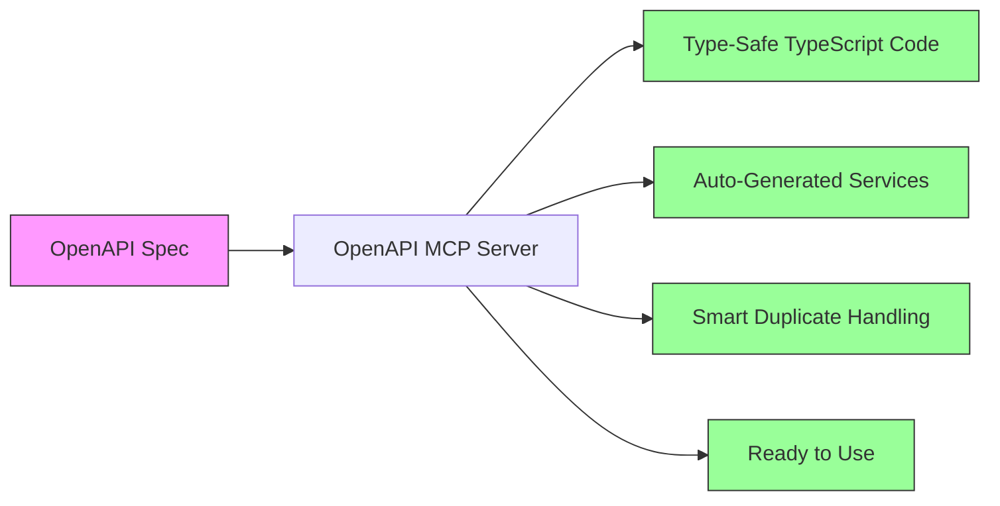
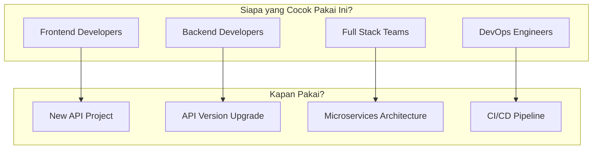
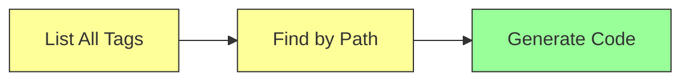
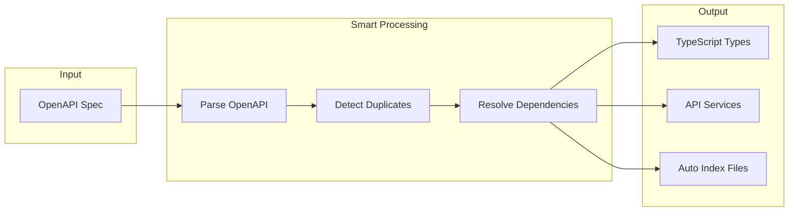
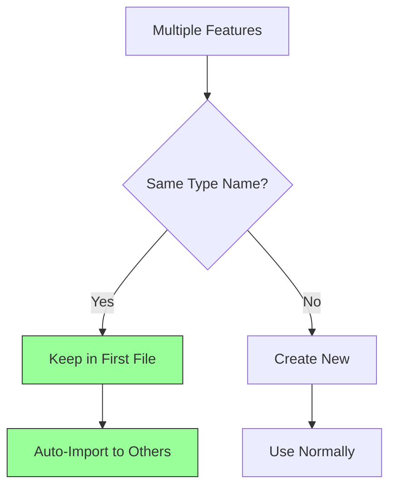
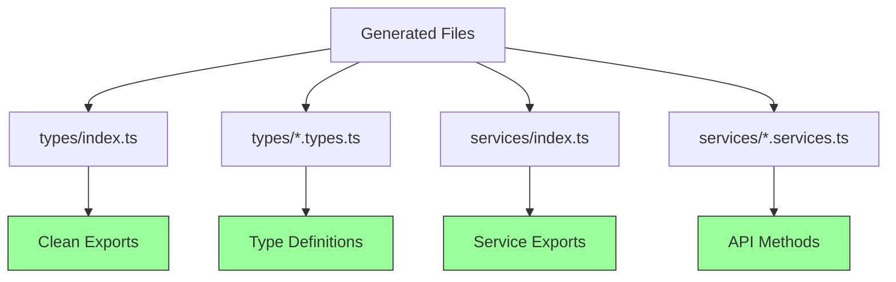
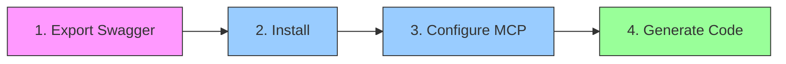
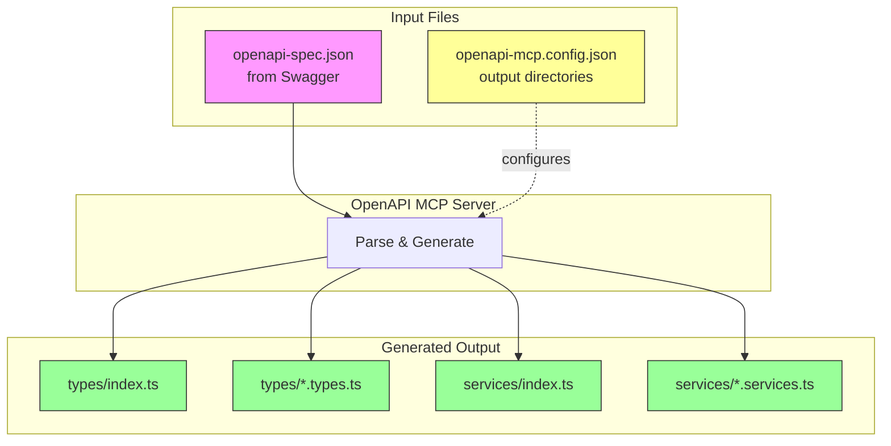

# OpenAPI MCP Server

> **Transform your OpenAPI specs into production-ready TypeScript code instantly**

OpenAPI MCP Server adalah Model Context Protocol (MCP) server yang mengubah OpenAPI specification menjadi TypeScript code yang type-safe, siap produksi, dan terstruktur dengan baik. Cukup berikan OpenAPI spec Anda, dan biarkan MCP server ini melakukan sisanya.

## ✨ Kenapa OpenAPI MCP Server?



### 🚀 Manfaat Utama

| Sebelum | Sesudah |
|---------|---------|
| ❌ Manual write types dari OpenAPI | ✅ Auto-generate dalam detik |
| ❌ Duplicate types di multiple files | ✅ Smart deduplication dengan auto-imports |
| ❌ Inconsistent naming conventions | ✅ Clean, consistent naming |
| ❌ No TypeScript validation | ✅ Compiled & validated |
| ❌ Manual index.ts updates | ✅ Auto-generated exports |

## 🎯 Use Cases



### 👥 Untuk Siapa?

- **Frontend Developers**: Dapatkan type-safe API client tanpa manual coding
- **Backend Developers**: Generate consistent types dari OpenAPI spec Anda
- **Full Stack Teams**: Maintain single source of truth dengan OpenAPI
- **DevOps Engineers**: Integrate ke CI/CD pipeline untuk auto-generation

## 🛠️ Fitur Unggulan

### 1. Smart Tag Discovery

Temukan endpoint yang Anda butuhkan dengan cepat:



- **list-tags**: Lihat semua available tags dengan jumlah endpoint
- **find-tag-by-path**: Cari endpoint berdasarkan URL pattern

### 2. Intelligent Code Generation



- **generate-typescript**: Quick generation untuk satu feature
- **generate-with-config** ⭐: Full-featured generation dengan smart features

### 3. Automatic Duplicate Handling

Tidak perlu khawatir dengan duplicate types! MCP server akan:



1. **Detect** duplicate types across features
2. **Keep** type di file pertama
3. **Remove** duplicates dari file lain
4. **Auto-import** type yang dibutuhkan

### 4. Production-Ready Output

Generated code yang langsung bisa dipakai:



- ✅ Type-safe dengan TypeScript validation
- ✅ Clean imports & exports
- ✅ JSDoc comments untuk IntelliSense
- ✅ Consistent naming conventions
- ✅ Axios-based API calls

## 🎮 Cara Pakai

### ⚠️ Required Files

Sebelum menggunakan MCP server ini, pastikan **2 file ini ada**:

| File | Purpose | Cara Dapatkan |
|------|---------|---------------|
| `openapi-spec.json` | OpenAPI specification dari API Anda | Export dari Swagger UI via DevTools Network tab |
| `openapi-mcp.config.json` | Config output directories untuk generated code | Buat manual di project root |

> 💡 **Penting:** Agent/MCP client tidak akan otomatis cek file-file ini. **Selalu mention di prompt** untuk memastikan code generation berjalan benar.

### Setup dalam 4 Langkah



**1. Export OpenAPI Spec dari Swagger:**

Pertama, dapatkan OpenAPI spec dari Swagger UI Anda. Cara paling reliable:

```bash
# Cara 1: Via Browser DevTools (Recommended - Works for all Swagger setups)
# 1. Buka Swagger UI API Anda di browser
# 2. Buka DevTools (F12) → Tab Network
# 3. Refresh page atau akses endpoint swagger
# 4. Cari request yang return OpenAPI spec (biasanya .json)
# 5. Klik kanan → Copy → Copy response
# 6. Save sebagai openapi-spec.json di project root

# Cara 2: Via Swagger UI direct link (jika tersedia)
# Buka http://your-api.com/swagger → Klik "Swagger JSON" → Save as openapi-spec.json

# Cara 3: Via curl (jika endpoint diketahui)
curl http://your-api.com/v3/api-docs -o openapi-spec.json
# atau
curl http://your-api.com/swagger/v1/swagger.json -o openapi-spec.json
```

> 💡 **Tip:** Setiap Swagger setup bisa beda endpoint. Cara paling aman adalah lewat **DevTools Network tab** untuk melihat response yang sebenarnya.

File `openapi-spec.json` ini adalah sumber truth untuk code generation.

**2. Install dependencies:**
```bash
npm install
```

**3. Buat 2 file konfigurasi:**

a. **openapi-mcp.config.json** - Konfigurasi output directories:
```json
{
  "typesOutputDir": "./src/types",
  "servicesOutputDir": "./src/services"
}
```

b. **openapi-spec.json** - OpenAPI spec dari Swagger (langkah 1)

**4. Add ke MCP client Anda (Claude Desktop, dll):**

```json
{
  "mcpServers": {
    "openapi": {
      "command": "node",
      "args": ["/path/to/openapi-mcp/dist/index.js"],
      "cwd": "/path/to/openapi-mcp"
    }
  }
}
```

### Contoh Penggunaan

#### Scenario 1: Explore API Structure

```
User: "Show me all available API endpoints"
MCP: [list-tags] → Returns all tags with endpoint counts

Input yang MCP butuhkan:
- specPath: "/path/to/openapi-spec.json" ⚠️ Required
```

#### Scenario 2: Find Specific Endpoint

```
User: "Find endpoints related to /reporting"
MCP: [find-tag-by-path] → Returns matching paths and operations

Input yang MCP butuhkan:
- specPath: "/path/to/openapi-spec.json" ⚠️ Required
- pathQuery: "/reporting" ⚠️ Required
```

#### Scenario 3: Generate Production Code ⭐

```
User: "Generate TypeScript code for reporting feature"
MCP: [generate-with-config] → Creates types & services files

Input yang MCP butuhkan:
- specPath: "/path/to/openapi-spec.json" ⚠️ Required - OpenAPI spec dari Swagger
- configPath: "./openapi-mcp.config.json" ⚠️ Required - Config output directories
- tag: "reporting-controller" (Optional - generate all if not specified)
```

> ⚠️ **Penting:** Selalu mention **kedua file** (`openapi-spec.json` dan `openapi-mcp.config.json`) di setiap prompt. Jangan skip config file karena MCP server butuh ini untuk menentukan output directories.

### File Structure yang Dibutuhkan

```
your-project/
├── openapi-mcp/              # MCP server
│   ├── dist/
│   └── package.json
│
├── openapi-spec.json         ← OpenAPI spec dari Swagger
├── openapi-mcp.config.json   ← Config output directories
│
└── your-app/
    ├── src/
    │   ├── types/            ← Generated types
    │   └── services/         ← Generated services
    └── package.json
```

## 📊 Hasil Generated Code

### Struktur File



### Contoh Usage di Code Anda

```typescript
// Import services & types
import { Reporting } from '@/services';
import type { SLACustomerDto } from '@/types';

// Use with full type safety! 🎉
const customers = await Reporting.getSLACustomers({ page: 1, limit: 10 });

// TypeScript will autocomplete and type-check everything
customers.forEach((customer: SLACustomerDto) => {
  console.log(customer.customerName); // ✅ Type-safe
});
```

## 🔧 Testing

Test generation dengan TypeScript validation:

```bash
# Full test dengan validation
npm run test

# Test specific feature
node dist/test-generate.js ../your-spec.json reporting-controller
```

## 📚 Dokumentasi Lengkap

Untuk technical details, architecture diagrams, dan development guide, lihat:

- **[ARCHITECTURE.md](./ARCHITECTURE.md)** - System architecture, class diagrams, data flow

## 🚀 Ready to Start?

```bash
# Clone & Install
git clone <repository>
cd openapi-mcp
npm install

# Build
npm run build

# Test
npm run test

# Start generating! 🎉
```

## 📋 Requirements

- Node.js >= 18
- TypeScript >= 5.0
- MCP-compatible client (Claude Desktop, dll)

## 🤝 Contributing

OpenAPI MCP Server adalah open source. Kontribusi selalu welcome!

## 📄 License

ISC

---

**Made with ❤️ for developers who love type-safe code**

*Stop writing boilerplate. Start building features.*
